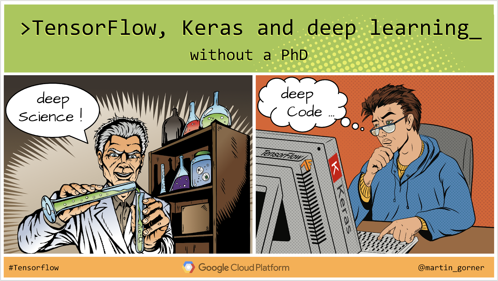

## Required pre-course reading

Martin Gorner's 123 min (approx.) course called [TensorFlow, Keras and deep learning, without a PhD](https://codelabs.developers.google.com/codelabs/cloud-tensorflow-mnist/#0) is a clear, approachable, fun introduction to neural networks.

## Suggested pre-requisites

To gain familiarity with machine learning and deep learning concepts and terminology, I recommend the following resources:

* a [visual introduction](http://www.r2d3.us/visual-intro-to-machine-learning-part-1/) to machine learning
* a recent [review](https://arxiv.org/abs/2006.13311) of machine learning in geoscience
* this recent deep learning [review](https://dennybritz.com/blog/deep-learning-most-important-ideas/) and this reading [roadmap](https://github.com/floodsung/Deep-Learning-Papers-Reading-Roadmap)
* Daniel Worrall's excellent introductory lecture to machine learning [video](https://www.youtube.com/watch?v=FrbWQDdGpHQ&feature=youtu.be&t=40) and [slides](https://deworrall92.github.io/docs/MLSSIndo1_lo_res.pdf)
* Daniel Worrall's introductory lecture to machine learning [video](https://www.youtube.com/watch?v=K59cmobQKew&feature=youtu.be&t=270) and [slides](https://deworrall92.github.io/docs/MLSSIndo2_lo_res.pdf)
* a [list of resources](https://www.notion.so/fd42b6a13305452ba17a5e2fa71467a2?v=7d56617d132e4ec3b98121ae1070f024) for machine learning application in remote sensing

## Week 1: Supervised Image Recognition

Live session: we'll log into USGS Pangeo on CHS, and work through jupyter notebooks containing workflows for image recognition (whole image classification)

Optional class assignment:

## Week 2: Supervised Image Object Detection

We'll log into USGS Pangeo on CHS, and work through jupyter notebooks containing workflows for image object detection (pixelwise classification)

Optional class assignment:

## Week 3: Supervised Image Segmentation

We'll log into USGS Pangeo on CHS, and work through jupyter notebooks containing workflows for image segmentation (pixelwise classification)

Optional class assignment:

## Week 4: Semi-supervised Image Classification

We'll log into USGS Pangeo on CHS, and work through jupyter notebooks containing workflows for more advanced and cutting edge *semi-supervised* methods for image recognition (whole image classification).

Optional class assignment:
