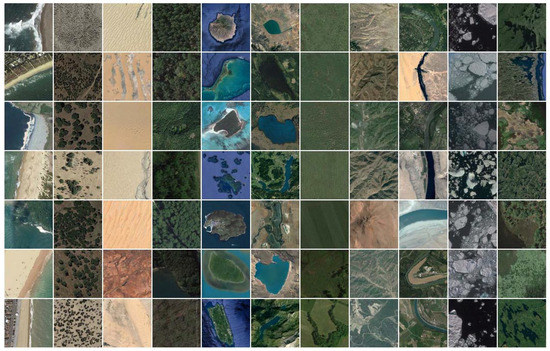
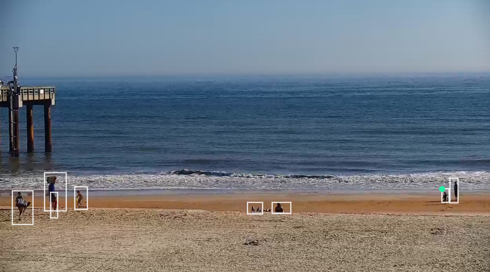
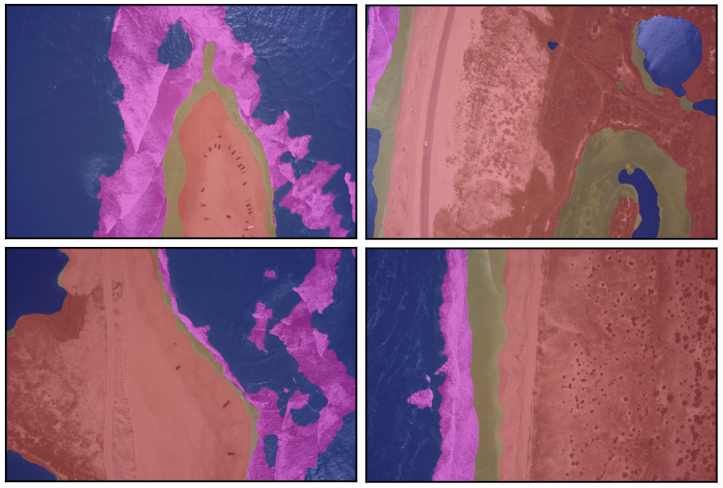

## Image Recognition

### *How much of the Texas coastline is developed?*

We will use publicly available imagery of coastal environments in Texas, provided by the Harte Research Institute at TAMUCC (Texas A&M University - Corpus Christi), funded by the Texas General Land Office (GLO).

Images such as the example above are oblique, taken from a low-altitude aircraft with approximate positions. In total, there are over 10,000 images covering the whole Texas coastline, each categorized by one of the following dominant classes ("developed" classes are in **bold**):

*  **Exposed walls and other structures made of concrete, wood, or metal**
*  Scarps and steep slopes in clay
*  Wave-cut clay platforms
*  Fine-grained sand beaches
*  Scarps and steep slopes in sand
*  Coarse-grained sand beaches
*  Mixed sand and gravel (shell) beaches
*  Gravel (shell) beaches
*  **Exposed riprap structures**
*  Exposed tidal flats
*  **Sheltered solid man-made structures, such as bulkheads and docks**
*  **Sheltered riprap structures**
*  Sheltered scarps
*  Sheltered tidal flats
*  Salt- and brackish-water marshes
*  Fresh-water marshes (herbaceous vegetation)
*  Fresh-water swamps (woody vegetation)
*  Mangroves

The dataset is described further [here](https://cloud.google.com/blog/products/ai-machine-learning/coastal-classifiers-using-automl-vision-to-assess-and-track-environmental-change). The dataset will be provided during the course, and is also available on Google Cloud Storage bucket `gs://aju-demos-coastline-images/coastline`

> Acknowledgements: This dataset is courtesy of Texas A&M University (See https://storage.googleapis.com/tamucc_coastline/GooglePermissionForImages_20170119.pdf  for details). Philippe Tissot, Associate Director, Conrad Blucher Institute for Surveying and Science, Texas A&M University - Corpus Christi; James Gibeaut, Endowed Chair for Coastal and Marine Geospatial Sciences, Harte Research Institute, Texas A&M University - Corpus Christi; and Valliappa Lakshmanan, Tech Lead, Google Big Data and Machine Learning Professional Services

#### Additional dataset

An additional dataset will be provided that you can work on using the same models introduced in the class on your own. This is a more conventional satellite-derived land use/land cover dataset, we chose the NWPU-RESISC45, which is a publicly available benchmark for REmote Sensing Image Scene Classification (RESISC), created by Northwestern Polytechnical University (NWPU). The entire dataset contains 31,500 high-resolution images from Google Earth imagery, in 45 scene classes with 700 images in each class. The majority of those classes are urban/anthropogenic. We chose to use a subset of 11 classes corresponding to natural landforms and land cover, namely: beach, chaparral, desert, forest, island, lake, meadow, mountain, river, sea ice, and wetland. For more details, see [this paper](https://www.mdpi.com/2076-3263/8/7/244)

## Object Detection

### *How do people use beaches?*

How often, and in how many numbers, do people use beaches? What times of the day and year are popular? How close to the water do people get? What is the proportion of swimmers versus non-swimmers? Many of these questions can be answered by observing people on beaches in video streams.

We will use publicly available web camera imagery from the SouthEast Coastal Ocean Observing Regional Association's [WebCAT](https://secoora.org/webcat/) service. WebCAT stands for the NOAA NOS (National Observing System) Web Camera Applications Testbed. These cameras have various purposes, for example counting right whales, identifying rip currents, validating wave models, and understanding human use of beaches, etc.

During the class, we will assume the role of someone tasked with understanding how humans use beaches. Therefore, we will identify, count and localize people in imagery of a beach. Of the web cameras in seven locations, we will only use imagery from the the camera installed at one site, namely St. Augustine Pier, Florida.

The imagery and associated label data have been curated especially for this course.

> SECOORA Data Disclaimer: There are no understandings, agreements, and representations, express or implied warranties (including any regarding merchantability or fitness for a particular purpose) respecting this data. Further, no employee of SECOORA, agent or other person is authorized to give any warranties on behalf of SECOORA, or to assume any liability in connection with the use of this data.

For more information about the data and its uses, see [here](https://secoora.org/data/#products)

## Image Segmentation

### *How much sand is there in the Outer Banks?*

The images above are examples of segmentations. The image is overlain with a colour-coded semi-transparent *label image* (as opposed to image label, as used in image recognition).

We will use very high-resolution digital images of coastal environments in the Outer Banks, North Carolina. The imagery and associated label data have been curated especially for this course, as part of the USGS Remote Sensing of Coastal Change Florence Supplemental Project.

The categories are (and corresponding colours in the above image):
* deep water (blue)
* white (broke, aerated) water (pink)
* shallow water and saturated ground (tan)
* dry sandy terrain (red)

> Acknowledgements: This dataset is courtesy of the U.S. Geological Survey. These data were collected as part of the USGS Remote Sensing of Coastal Change Florence Supplemental Project, and processed collectively by Wayne Wight (USGS Contractor), Jonathan Warrick (USGS-PCSMC), Christopher Sherwood (USGS-WHCMSC), Andrew Ritchie (USGS-PCSMC), Jenna Brown (USGS-MD-DE-DC WSC), Christine Kranenburg (USGS-SPCMSC), Jin-Si Over (USGS-WHCMSC), and Daniel Buscombe (USGS-PCSMC contractor). Although these data have been processed successfully on a computer system at the U.S. Geological Survey (USGS), no warranty expressed or implied is made regarding the display or utility of the data for other purposes, nor on all computer systems, nor shall the act of distribution constitute any such warranty. The USGS or the U.S. Government shall not be held liable for improper or incorrect use of the data described and/or contained herein.

#### Additional dataset
An additional dataset will be provided that you can work on using the same models introduced in the class on your own. This [dataset](https://scholars.duke.edu/display/pub1419444) consists of aerial UAV colour imagery and labels of oyster reefs in shallow water, made publicly available by Duke University researcher [Patrick Gray](https://github.com/patrickcgray/oyster_net). There are two labels: `reef` and `no reef`.

