## Convolutional Neural Networks

There are two main drawbacks with neural networks consisting of only dense layers for classifying images:

1. Too many parameters means even simple networks on small and low-dimensional imagery take a long time to train

2. There is no concept of spatial distance, so the relative proximity of image features or that with respect to the classes, is not considered

For both the reasons above, Convolutional Neural Networks or CNNs have become popular for working with imagery. CNNs train in a similar way to "fully connected" ANNs that use Dense layers throughout.

CNNs can handle multidimensional data as inputs, meaning we can use 3- or more band imagery, which is typical in the geosciences. Also, each neuron isn't connected to all others, only those within a region called the `receptive field` of the neuron, dictated by the size of the convolution filter used within the layer to extract features from the image. By linking only subsets of neurons, there are far fewer parameters for a given layer

So, CNNS take advantage of both multidimensionality and local spatial connectivity

CNNs tend to take relatively large imagery and extract smaller and smaller feature maps. This is achieved using `pooling` layers, which find and compress the features in the feature maps outputted by the CNN layers, so images get smaller and features are more pronounced

In each of the ML-Mondays parts, we'll use a different model built on top of convolutional neural networks or CNNs. In week 1, CNNs will be used as feature extractors at one scale. In week 2, they will be used to extract features at multiple scales. In week 3, we'll use CNNs to extract and merge features extracted at multiple scales. Finally, in week 4 we'll use CNNs to extract a very low dimensional feature from data that we hope encodes just the essential classifying properties of that data. In combination, these workflows serve to exemplify the potentially wide-ranging utility of machine learning models built using CNNs for image description, classification, segmentation and image-object detection and localization.  

## Image recognition
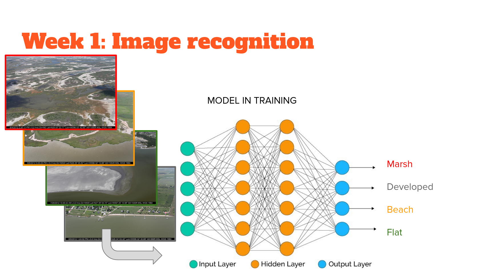

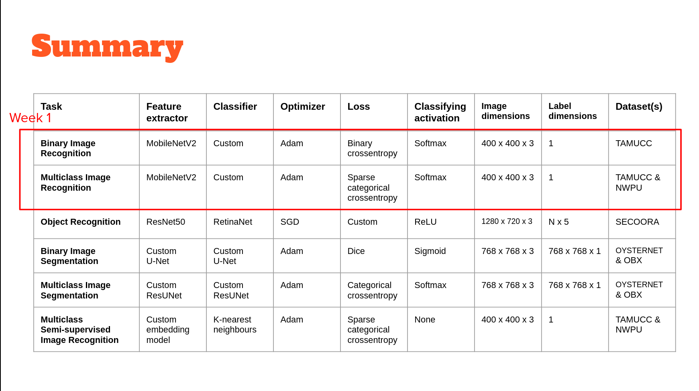

[MobileNets](https://arxiv.org/abs/1704.04861) were the first model to use "depthwise separable convolution" to reduce the complexity and size of the network, suitable to Mobile devices, or other devices with low computational power.

[MobileNetV2](https://arxiv.org/abs/1801.04381) improves on V1 by 1) using linear bottlenecks between the layers, where the last convolution of a residual block has a linear output before it’s added to the initial activations, and 2) using residual connections between the bottlenecks which helps with training convergence and performance.

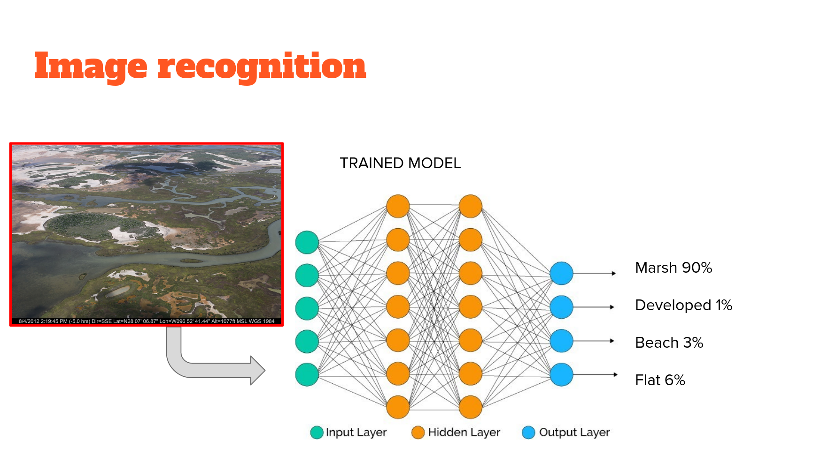

Here we use it as an all-purpose image feature extractor. We use it with and without weights learned on the imagenet dataset (or "imagenet weights"). It is relatively small, so quick to train (even from scratch, as we will see) and fine-tune. It is compiled for certain sized imagery but works with any size within the range (and the keras implementation automatically detects which weights to use). It works well for a range of tasks, and I have used it extensively in my own work for both image classification and regression tasks (see [here](https://www.sciencedirect.com/science/article/pii/S0378383919301243) and [here](https://www.mdpi.com/2072-4292/11/7/859), for example).

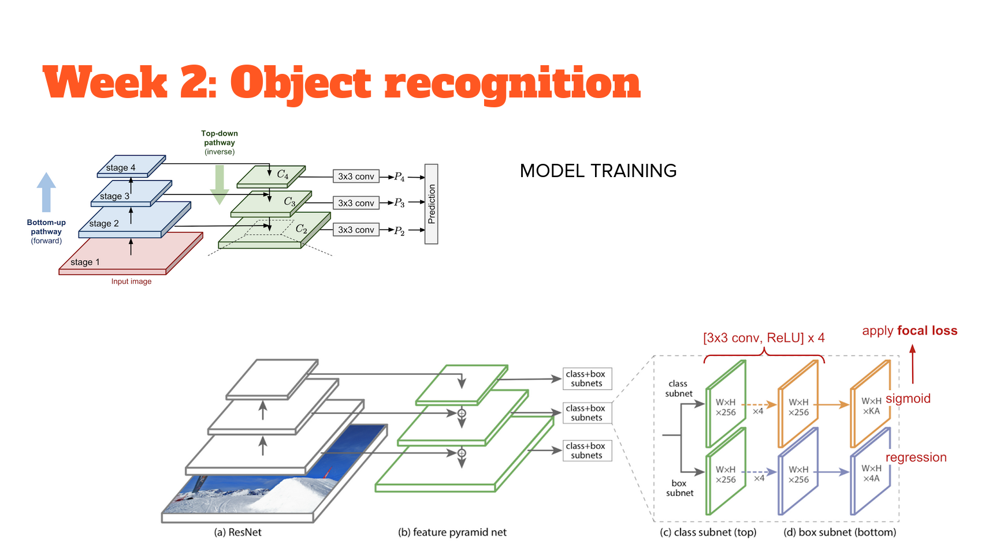

## Object recognition

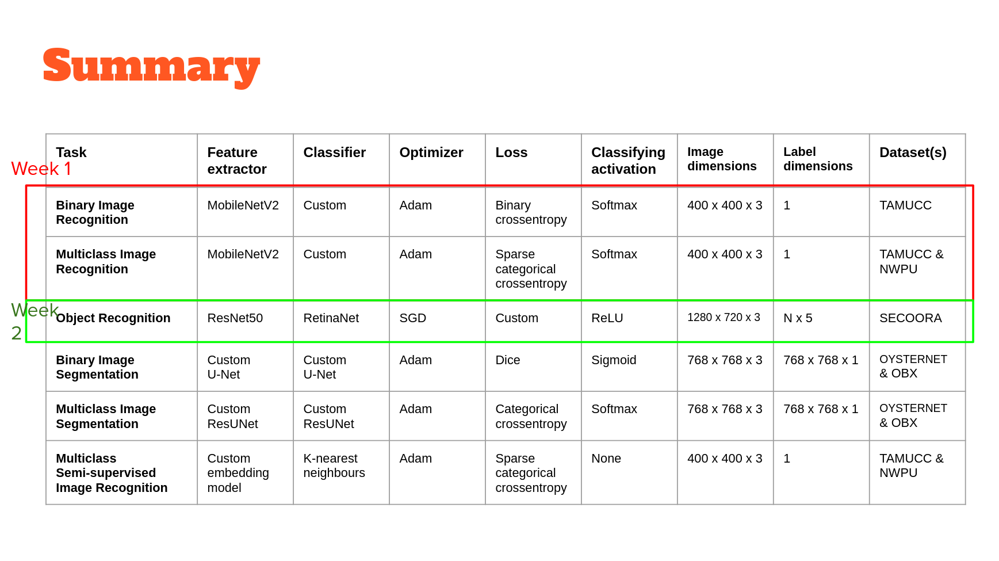

RetinaNet is a popular single-stage object detector, which is accurate and runs fast. It uses a feature pyramid network to efficiently detect objects at multiple scales and uses a new Focal loss function, to alleviate the problem of the extreme foreground-background class imbalance.

It consists of a bottom-up pathway and top-down pathway. The bottom-up is called the 'backbone' network (e.g. ResNet50) that calculates the feature maps at different scales, irrespective of the input image size. The top down pathway upsamples the spatially coarser feature maps from higher pyramid levels, with residual (lateral) connections merge the top-down layers and the bottom-up layers with the same spatial size.

At each prediction level (using ResNet50 gives us 5), there is a classification subnetwork that predicts the probability of an object being present at each spatial location and object class, and a regression subnetwork, which regresses the offset for the bounding boxes from the anchor boxes for each ground-truth object.

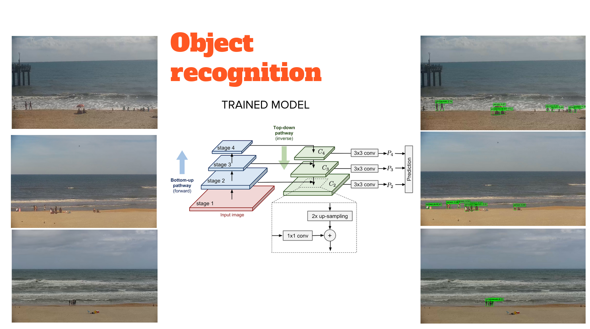

Object detectors suffer from an extreme class imbalance: the detectors evaluate roughly between ten to hundred thousand candidate locations and of course most of these boxes do not contain an object. This class imbalance in cross-entropy means that loss is relatively high, even if the model is relatively sure. RetinaNet deals with this by using focal loss instead; the loss is now significantly lower for a given confidence level. The implementation used here borrows heavily from [this tutorial](https://keras.io/examples/vision/retinanet/)

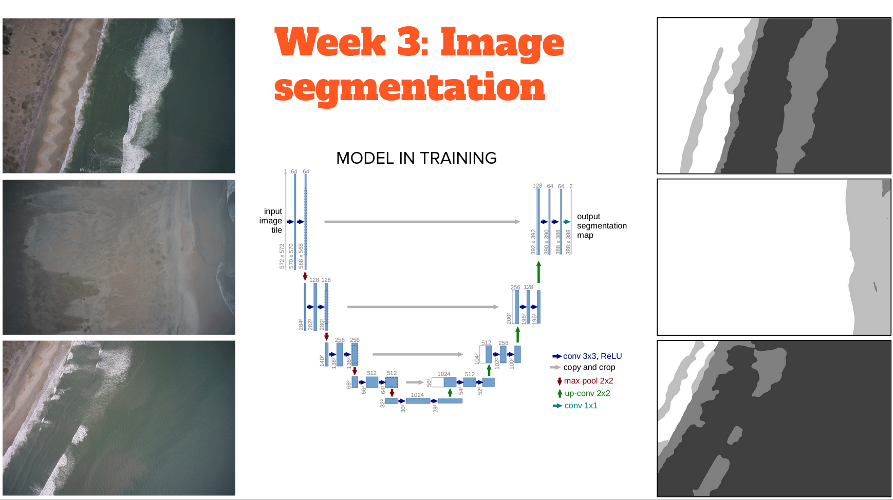

## Image Segmentation

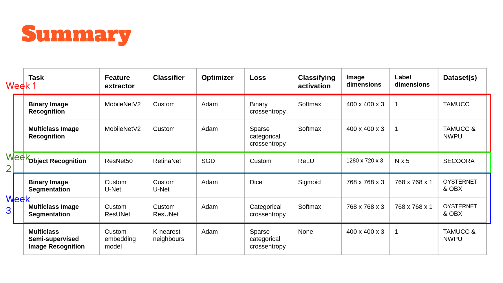

Introduced in 2015, the U-Net model is relatively old in the deep learning field (!) but still popular and is also commonly seen embedded in more complex deep learning models

The U-Net model is a simple fully  convolutional neural network that is used for binary segmentation i.e foreground and background pixel-wise classification. Mainly, it consists of two parts.

*  Encoder: we apply a series of conv layers and downsampling layers  (max-pooling) layers to reduce the spatial size
*  Decoder: we apply a series of upsampling layers to reconstruct the spatial size of the input.

The two parts are connected using a concatenation layers among different levels. This allows learning different features at different levels. At the end we have a simple conv 1x1 layer to reduce the number of channels to 1.

U-Net is symmetrical (hence the "U" in the name) and uses concatenation instead of addition to merge feature maps

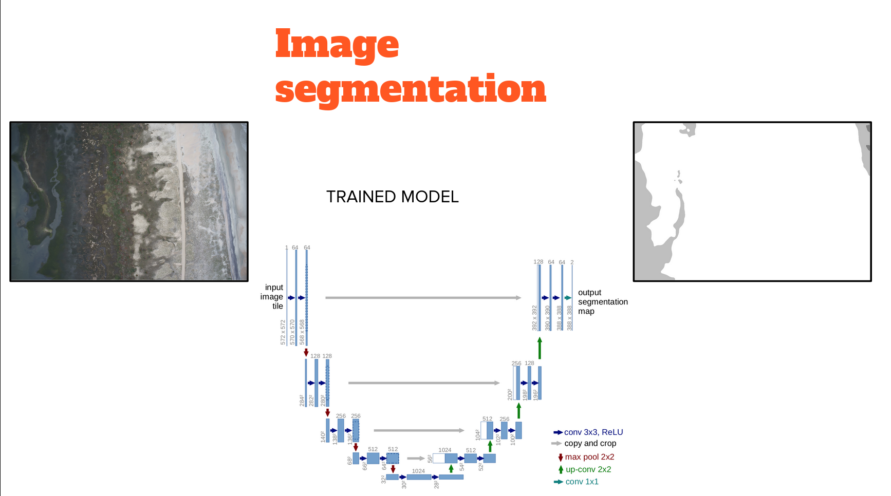

The encoder (left hand side of the U) downsamples the N  x N x 3 image progressively using six banks of convolutional filters, each using filters double in size to the previous, thereby progressively downsampling the inputs as features are extracted through max pooling

A 'bottleneck' is just machine learning jargon for a very low-dimensional feature representation of a high dimensional input. Or, a relatively small vector of numbers that distill the essential information about a large image
An input of N x N x 3 (>>100,000 numbers) has been distilled to a 'bottleneck' of 16 x 16 x M (<<100,000 numbers)

The decoder (the right hand side of the U) upsamples the bottleneck into a N  x N x 1 label image progressively using six banks of convolutional filters, each using filters half in size to the previous, thereby progressively upsampling the inputs as features are extracted through transpose convolutions and concatenation. A transposed convolution is a relatively new type of deep learning model layer that convolves a dilated version of the input tensor, in order to upscale the output. The dilation operation consists of interleaving zeroed rows and columns between each pair of adjacent rows and columns in the input tensor. The dilation rate is the stride length

Finally, make the classification layer using one final convolutional layers that essentially just maps (by squishing over 16 layers) the output of the previous layer to a single 2D output (with values ranging from 0 to 1) based on a sigmoid activation function

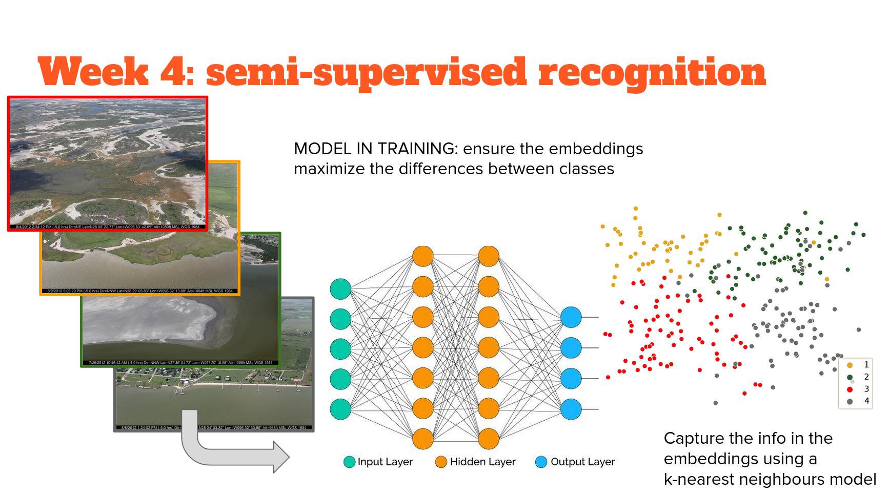

## Semi-supervised image recognition

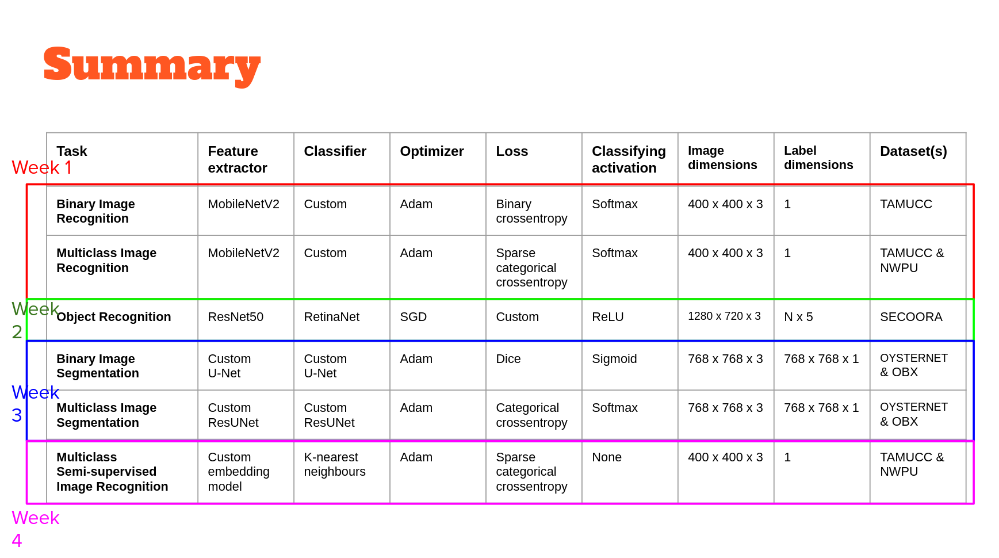

In part 1, we trained a network 'end to end' in an extremely discriminative approach that explicitly mapped the classes to the image features extracted by MobileNetV2, and optimized to extract the features that explicitly predict the class. I call this approach 'extremely discriminative' because it was supervised to the level where there is no room for ambiguity - every image falls into one class or another, despite the obvious continuum that exists between them, and between features that covary with them. Therefore the confidence metric we get is as much a reflection of the model feature extraction and classification process as it is. For example, how much information is loss when we use Relu as an activation function, which zeros out half the data?

This time, we will use a network to extract features based on those that maximize the distance between classes in feature space. We'll get a measure of distance between data points that, while abstracted, is a better reflection of the actual difference between samples of different classes than those of a fully supervised model.

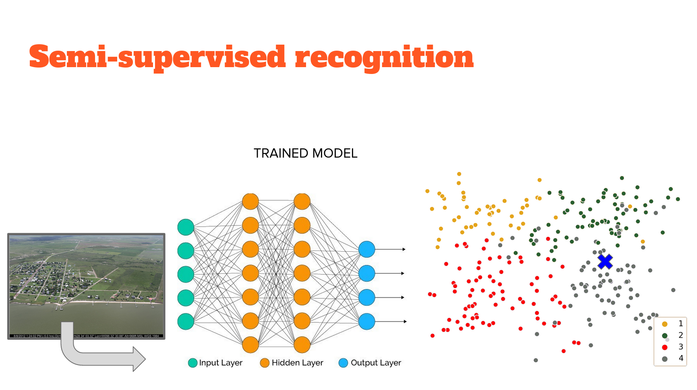

Why isn't this a fully supervised model? This isn't the same level of 'supervision' in network training - instead of extracting features that predict the class, features are extracted so they are maximally similar to features from other images in the same class, and maximally distant from features in all other classes. There is no mapping from features to class. Only feature extraction based on a knowledge of which images are in the same class. Therefore this approach is known as 'weakly supervised' image feature extraction. The network we use is an example of an 'autoencoder' that embeds the information in the image into a lower dimensional space. Therefore the extracted features are called 'embeddings'.

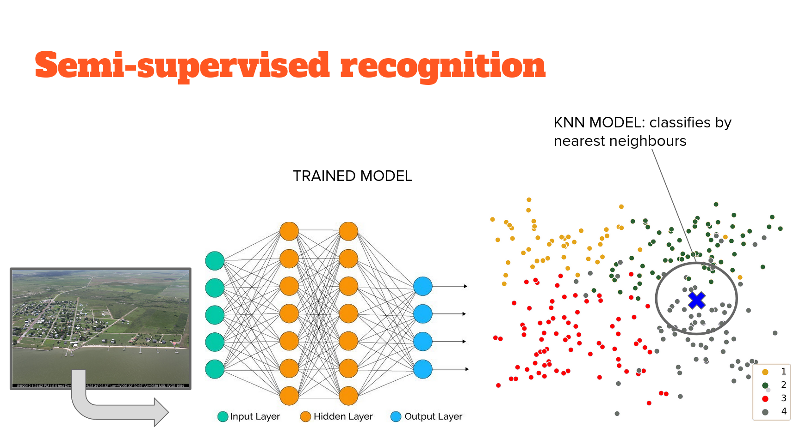

Nor does this feature extraction result in classification directly - we don't use a classifying head to inform how image features are extracted. So, we have to utilize another - completely unsupervised - model to carry out classification. The way that this problem is structured is amenable to several unsupervised approaches. We use perhaps the simplest, conceptually; K-nearest neighbours. The idea is that it will cluster those embeddings (extracted features) and classification is based on the class of the K nearest neighbours with the K most similar embeddings. The implementation used here borrows heavily from [this tutorial](https://keras.io/examples/vision/metric_learning/) and this [youtube](https://www.youtube.com/watch?v=Jb4Ewl5RzkI) by the technique's originator, Mat Kelcey.
