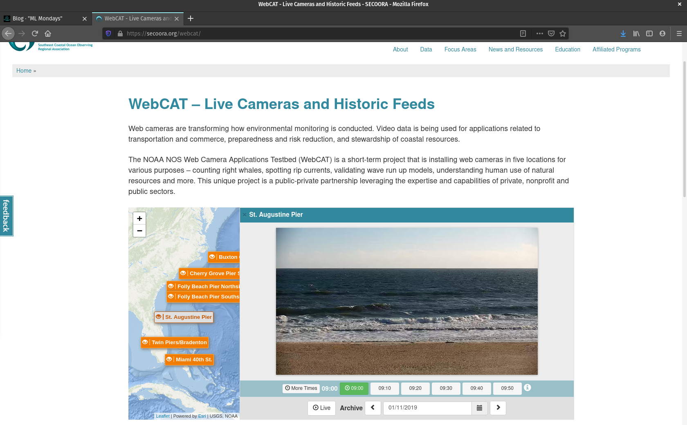

You can access from the NOAA NOS Web Camera Applications Testbed (WebCAT) [Live Cameras and Historic Feeds](https://secoora.org/webcat/) site. The image above shows how to view the image I will use in the demonstration below.

To extract a subsection (or trim) of the file  `staugustinecam.2019-01-11_0900.mp4`, from 1 min 47 s to 6 min 22 s, and output it to the file `staugustinecam.2019-01-11_0900_trim.mp4`:

```
ffmpeg -i staugustinecam.2019-01-11_0900.mp4 -ss 00:01:47 -t 00:06:22 -async 1 staugustinecam.2019-01-11_0900_trim.mp4
```

To extract `png` format files from that trimmed video, writing the frame number to the file name:

```
ffmpeg -i staugustinecam.2019-01-11_0900_trim.mp4 staugustinecam.2019-01-11_0900_%d.png
```

Make a directory:

```
mkdir staugustinecam_2019-01-11_0900
```

Move all of the `png` files into that directory:

```
mv *.png staugustinecam_2019-01-11_0900
```

Make a bash script so you can execute the decompiling (only) sequence of commands on an arbitrary mp4 file from the command line. First, open a new file called `nano decompile_mp4.sh`:

```
nano decompile_mp4.sh
```

and write or copy the following into it:

```
echo "decompiling video file $1, and moving png frames into $2, in T minus 5 seconds ..."
sleep 5s
ffmpeg -i $1 $2_%d.png
mkdir $2
mv *.png $2
```

To exit `nano`:

`Ctrl+X` (for exit)
`Y` (for yes)
`enter` (for save)

Use it like this:

```
bash decompile_mp4.sh myvid.mp4 myframes
```

To extract 1 frame per minute, modify to:

```
echo "decompiling video file $1 - one frame every minute, and moving png frames into $2, in T minus 5 seconds ..."
sleep 5s
ffmpeg -i $1 -vf fps=1/60 $2_%d.png
mkdir $2
mv *.png $2
```


Let's say you've carried out the above procedure on lots of videos and you have lots of folders containing frames. Now you want to randomly move some images from each directory into three separate folders that you'll use in your deep learning project, called `test`, `train`, and `validate` (it is also common to use `test` for the purposes of both testing and validating)

```
mkdir train
mkdir test
mkdir validate
```

To move 10 random files to each from a directory called `my_directory` containing png frames:

```
cd my_directory
shuf -n 10 -e * | xargs -i mv {} ../train/
shuf -n 10 -e * | xargs -i mv {} ../test/
shuf -n 10 -e * | xargs -i mv {} ../validate/
```

or to generalize:

```
for direc in st*/
do
cd $direc
shuf -n 10 -e * | xargs -i mv {} ../train/
shuf -n 10 -e * | xargs -i mv {} ../test/
shuf -n 10 -e * | xargs -i mv {} ../validate/  
cd ..
done
```

In the above, I say `st*/` to list only directories beginning with `st`, rather than listing all directories (`/*`), which would include `test`, `train`, and `validate` and would not work

Finally, to convert all png files to jpg files, use:

```
mogrify -format jpg *.png
```
