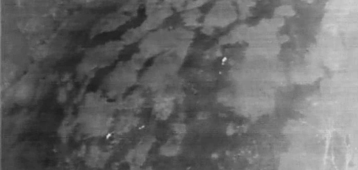
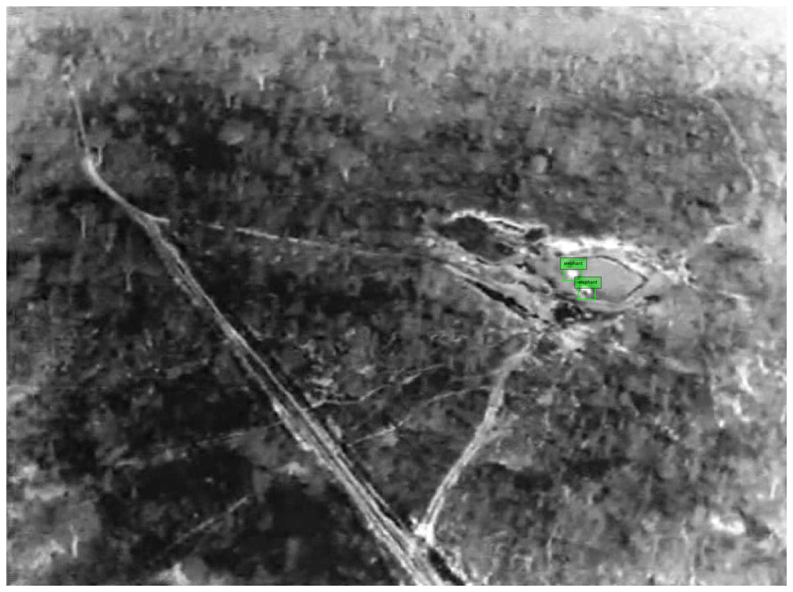

Formatting your own data into a format that you can use in your data processing pipeline is arguably the most difficult aspect of this largely self-guided course.

The workflows I have provided each week to create tfrecords can be adapted to many different datasets, but will require some work on your part, using my provided examples and these blog posts. I don't know of any package that helps you out for every case. Perhaps I should write one! Perhaps you should!

We're going to:
* download some data from the internet
* convert the labels data into a format we can use
* write all the data to one big TFrecord file
* write the data out in chunks to TFRecord shards

This workflow is also provided in the following script: `2_ObjRecog/conservationdrones_make_tfrecords.py`

## Convert images and bounding boxes into TFrecords

### Prepare your dataset as images and corresponding labels
To create an example, I headed over the excellent [Labeled Information Library of Alexandria: Biology and Conservation](http://lila.science/datasets/) and chose the [Conservation Drones](http://lila.science/datasets/conservationdrones) dataset. Specifically, I downloaded [TrainReal.zip](https://lilablobssc.blob.core.windows.net/conservationdrones/TrainReal.zip). Each of these folders contains folders for the annotation .csv files for each video (annotations) and the individual .jpg frames in each video (images).

We're not afraid of real-world examples in ML-Mondays - I chose a particularly difficult computer vision problem. We'll see why ...

I unzipped the TrainReal data to a folder on my computer called `/media/marda/TWOTB/USGS/DATA/TrainReal`, which contains `images` (jpegs) and `labels` (annotations in csv format). Here is an example image. Notice it is infrared and therefore greyscale. That's ok- the models we use can cope with single-banded inputs



The associated label data for this image is

```
142	2	276	243	11	12	0	2	0	0
142	4	204	260	16	13	0	2	0	0
142	5	266	246	11	10	0	2	0	0
142	108	424	136	11	12	0	2	0	0
142	114	430	101	17	21	0	2	0	0
142	115	429	121	11	11	0	2	0	0
```

This is the [MOT](https://motchallenge.net/instructions/) annotation format, with the following columns:

```
[frame_number], [object_id], [x], [y], [w], [h], [class], [species], [occlusion], [noise]
```

* class: 0 if animals, 1 if humans
* species: -1: unknown, 0: human, 1: elephant, 2: lion, 3: giraffe, 4: dog, 5: crocodile, 6: hippo, 7: zebra, 8: rhino. 3 and 4 occur only in real data. 5, 6, 7, 8 occur only in synthetic data.
* occlusion: 0 if there is no occlusion, 1 if there is an occlusion (i.e., either occluding or occluded) (note: intersection over union threshold of 0.3 used to assign * occlusion; more details in paper)
* noise: 0 if there is no noise, 1 if there is noise (note: noise labels were interpolated from object locations in previous and next frames; for more than 4 consecutive frames without labels, no noise labels were included; more details in paper)

So, based on this info, we have 6 lions in the scene, each only 10-20 pixels in size

### Converting between label formats

The first thing we need to do is convert this csv format into one of

```
[filename],	[width], [height], [class], [xmin], [ymin], [xmax], [ymax]
```

which is perhaps slightly more standard for deep learning workflows. You could do this manually in excel, by using `w` and `h` to compute `xmax` and `ymax`, then convert the `frame_number` into a `filename`. In this case we'll use `species` as `class`.

Honestly, every dataset has its foibles and you have to `wrangle` the data into one form or another, so get used to it! The python library `pandas` can help a lot in these situations. I won't lie - this is tricky - as I said before, the data part of any data modeling project is just as hard - if not more so - than the 'modeling' part.

### Combining all csv files into one

These are the libraries we'll need:

```
import pandas as pd
import numpy as np
from glob import glob
import os
```

This is the top level directory where all the annotation csv files are

```
csv_folder = '/media/marda/TWOTB/USGS/DATA/TrainReal/annotations'
```

First we define empty lists to collate image file names, and to concatenate all label data into one list

```
all_label_data = []; files = []
```

We cycle through each csv file, read it in using pandas, and append it to `all_label_data`. Next we get the filename of the image that `id` (column zero) corresponds to. This is not an easy file naming convention to deal with ... all strings are forced to have the same length.

```
for f in csv_files:
    dat = np.array(pd.read_csv(f))
    all_label_data.append(dat)
    # get the file name root
    tmp = f.replace('annotations', 'images').replace('.csv','')
    # construct filenames for each annotation
    for i in dat[:,0]:
       if i<10:
          files.append(tmp+os.sep+tmp.split(os.sep)[-1]+'_000000000'+str(i)+'.jpg')
       elif i<100:
          files.append(tmp+os.sep+tmp.split(os.sep)[-1]+'_00000000'+str(i)+'.jpg')
       elif i<1000:
          files.append(tmp+os.sep+tmp.split(os.sep)[-1]+'_0000000'+str(i)+'.jpg')
       elif i<10000:
          files.append(tmp+os.sep+tmp.split(os.sep)[-1]+'_000000'+str(i)+'.jpg')
       elif i<100000:
          files.append(tmp+os.sep+tmp.split(os.sep)[-1]+'_00000'+str(i)+'.jpg')

```       

We use numpy's `vstack` to concatenate the list of lists into a numpy array with the correct shape (samples x columns)

```
all_label_data = np.vstack(all_label_data)
files = np.vstack(files).squeeze()

print(all_label_data.shape)
# 87167 annotations, 10 columns
print(files.shape)
# 87167 filenames, 1 column
```

We have converted all the ids to filenames already, next we need to make xmaxs ymaxs

```
xmax = all_label_data[:,2] + all_label_data[:,4] #xmin + width
ymax = all_label_data[:,3] + all_label_data[:,5] #ymin + height
```

Next we map the integers to strings - strings are better in general than integers for class identification

```
# list of integers
classes = all_label_data[:,7]
# mapping from integers to strings
class_dict = {-1:'unknown',0: 'human', 1:'elephant', 2:'lion', 3:'giraffe'}
#list of strings
classes_string = [class_dict[i] for i in classes]
```

Make a pandas dataset so we can write it out to csv file

```
d = {'filename': files, 'width': all_label_data[:,4], 'height': all_label_data[:,5], 'class': classes_string,
     'xmin': all_label_data[:,2], 'ymin': all_label_data[:,3], 'xmax': xmax, 'ymax': ymax }
df = pd.DataFrame(data=d)
```

Interrogate the columns:
```
df.keys()
```

Print the first few examples to screen:

```
df.head()
```

Print the last few examples to screen:

```
df.tail()
```

Write to file:

```
df.to_csv('conservationdrones_labels.csv')
```

Much better! All labels are in one file, that is more manageable and easier to read (in fact, it is stand-alone)

### Writing data to a single TFRecord

Define some paths and inputs

```
root = 'data/conservationdrones'+os.sep
output_path = root+'conservationdrones.tfrecord'
csv_input = root+'conservationdrones_labels.csv'
```

Initiate a `TFRecordWriter` object that will write the TFRecords

```
import tensorflow as tf
writer = tf.io.TFRecordWriter(output_path)
```

Each image has variable number of annotations, so just like in the SECORRA example, we split the data into groups based on filename

```
examples = pd.read_csv(csv_input)
print('Number of labels: %i' % len(examples))
grouped = split(examples, 'filename')
```

How many images?

```
nb_images=len(grouped)
print('Number of images: %i' % nb_images)
```

We need a function like `create_tf_example_coco` that creates a bytestring from an image and associated boundng box

The following function differs from `create_tf_example_coco` in that filename paths need not be specified and concatenated, and that `class_dict = {'unknown':-1,'human':0,'elephant':1, 'lion':2, 'giraffe':3}` is usd to convert the strings back to integers

```
def create_tf_example_conservationdrones(group):
    """
    create_tf_example_conservationdrones(group)
    ""
    This function creates an example tfrecord consisting of an image and label encoded as bytestrings
    The jpeg image is read into a bytestring, and the bbox coordinates and classes are collated and
    converted also
    INPUTS:
        * group [pandas dataframe group object]
        * path [tensorflow dataset]: training dataset
    OPTIONAL INPUTS: None
    OUTPUTS:
        * tf_example [tf.train.Example object]
    GLOBAL INPUTS: BATCH_SIZE
    """
    with tf.io.gfile.GFile(group.filename, 'rb') as fid:
        encoded_jpg = fid.read()
    encoded_jpg_io = io.BytesIO(encoded_jpg)

    filename = group.filename.encode('utf8')

    ids = []
    areas = []
    xmins = [] ; xmaxs = []; ymins = []; ymaxs = []
    labels = []
    is_crowds = []

    #for converting back to integer
    class_dict = {'unknown':-1,'human':0,'elephant':1, 'lion':2, 'giraffe':3}

    for index, row in group.object.iterrows():
        labels.append(class_dict[row['class']])
        ids.append(index)
        xmins.append(row['xmin'])
        ymins.append(row['ymin'])
        xmaxs.append(row['xmax'])
        ymaxs.append(row['ymax'])
        areas.append((row['xmax']-row['xmin'])*(row['ymax']-row['ymin']))
        is_crowds.append(False)

    tf_example = tf.train.Example(features=tf.train.Features(feature={
        'objects/is_crowd': int64_list_feature(is_crowds),
        'image/filename': bytes_feature(filename),
        'image/id': int64_list_feature(ids),
        'image': bytes_feature(encoded_jpg),
        'objects/xmin': float_list_feature(xmins), #xs
        'objects/xmax': float_list_feature(xmaxs), #xs
        'objects/ymin': float_list_feature(ymins), #xs
        'objects/ymax': float_list_feature(ymaxs), #xs
        'objects/area': float_list_feature(areas), #ys
        'objects/id': int64_list_feature(ids), #ys
        'objects/label': int64_list_feature(labels),
    }))

    return tf_example
```

Now we can write out each group (bounding boxes of each image)

```
for group in grouped:
    tf_example = create_tf_example_conservationdrones(group)
    writer.write(tf_example.SerializeToString())
```

Close the writer  - we are done!

```
writer.close()
output_path = os.path.join(os.getcwd(), output_path)
print('Successfully created the TFRecords: {}'.format(output_path))
```

This is a big file (1.2 GB). But not as big as the 42,684 individual files that this one file contains, which is 2.3 GB

How do we split this big TFRecord up in small chunks?

### Writing data to multiple TFRecords

This time we'll create smaller files with 1000 examples per file

```
ims_per_shard = 1000
```

How many individual files would we make?

```
SHARDS = int(nb_images / ims_per_shard) + (1 if nb_images % ims_per_shard != 0 else 0)
print(SHARDS)

shared_size = int(np.ceil(1.0 * nb_images / SHARDS))
print(shared_size)
```

Create indices into grouped that will enable writing SHARDS files, each containing shared_size examples

```
grouped_forshards = np.lib.stride_tricks.as_strided(np.arange(len(grouped)), (SHARDS, shared_size))
```

Write out each group to a different TFRecord file. Update a counter to increment the file name.

```
counter= 0
for indices in grouped_forshards[:-1]:

    tmp = [] #create a new list containing only data in indices
    for i in indices:
        tmp.append(grouped[i])

    # modify the original filepath in a consistent way
    output_path = root+'conservationdrones.tfrecord'
    output_path = output_path.replace('.tfrecord','')+ "{:02d}-{}.tfrec".format(counter, shared_size)
    writer = tf.io.TFRecordWriter(output_path)

    # write out each example to the shard
    for group in tmp:
        tf_example = create_tf_example_conservationdrones(group)
        writer.write(tf_example.SerializeToString())

    writer.close()
    print('Successfully created the TFRecords: {}'.format(output_path))

    counter += 1
```

### How do you know you did it right?

You should read the data back in and plot it. Get a list of the tfrec files you made:

```
filenames = sorted(tf.io.gfile.glob(os.getcwd()+os.sep+root+'*.tfrec'))
```

This dictionary and associated parsing function is what you need to decode

```
features = {
    'image': tf.io.FixedLenFeature([], tf.string, default_value=''),
    'objects/xmin': tf.io.FixedLenSequenceFeature([], tf.float32, allow_missing=True),
    'objects/ymin': tf.io.FixedLenSequenceFeature([], tf.float32,allow_missing=True),
    'objects/xmax': tf.io.FixedLenSequenceFeature([], tf.float32,allow_missing=True),
    'objects/ymax': tf.io.FixedLenSequenceFeature([], tf.float32,allow_missing=True),
    'objects/label': tf.io.FixedLenSequenceFeature([], tf.int64,allow_missing=True),
}

def _parse_function(example_proto):
  # Parse the input `tf.train.Example` proto using the dictionary above.
  return tf.io.parse_single_example(example_proto, features)
```

Create a `TFRecordDataset` object from the list of files, and using the parsing function to create the dataset
```
dataset = tf.data.TFRecordDataset(filenames)
dataset = dataset.map(_parse_function)
```

Import a plotting library

```
import matplotlib.pyplot as plt
```

Get ten images and their associated labels and plot them

```
for i in dataset.take(10):
    image = tf.image.decode_jpeg(i['image'], channels=1)
    bbox = tf.numpy_function(np.array,[[i["objects/xmin"], i["objects/ymin"], i["objects/xmax"], i["objects/ymax"]]], tf.float32).numpy().T#.squeeze()
    print(len(bbox))

    ids = []
    for id in i["objects/label"].numpy():
       ids.append(class_dict[id])

    fig =plt.figure(figsize=(16,16))
    plt.axis("off")
    plt.imshow(image, cmap=plt.cm.gray)
    ax = plt.gca()

    for box,id in zip(bbox,ids):
        x1, y1, x2, y2 = box
        w, h = x2 - x1, y2 - y1
        patch = plt.Rectangle([x1, y1], w, h, fill=False, edgecolor=[0, 1, 0], linewidth=1)
        ax.add_patch(patch)
        ax.text(x1, y1, id, bbox={"facecolor": [0, 1, 0], "alpha": 0.4}, clip_box=ax.clipbox, clip_on=True, fontsize=5)
    plt.show()
```

Here's an example output. Two tiny(!) elephants in scene:



### last word ...
Datasets like this are extremely difficult to acquire and in my view are just as valuable as other types of scholarly output, so I encourage you to publish your datasets (if they are [F.A.I.R](https://www.go-fair.org/fair-principles/)) and cite other's data. If you use this dataset, please consider citing the paper:

> Bondi E, Jain R, Aggrawal P, Anand S, Hannaford R, Kapoor A, Piavis J, Shah S, Joppa L, Dilkina B, Tambe M. BIRDSAI: A Dataset for Detection and Tracking in Aerial Thermal Infrared Videos.

Thanks to the authors for making it publicly available.
